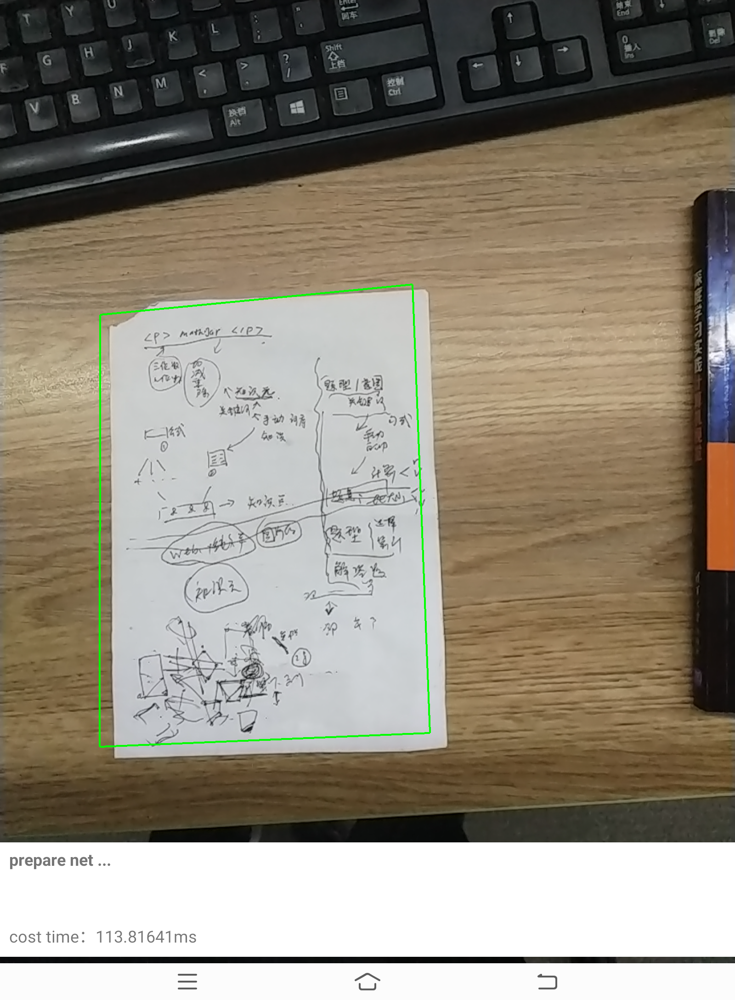

# doc_Detection

>这是一个文档检测Android的demo。使用MNN推理。速度很快。

## 快速体验
- 1.adb install app-debug.apk
- 2.adb push frozen_model.mnn /sdcard/frozen_model.mnn

## 如何建立自己的文档检测apk
- 1.模型训练
>参考如下文章
https://zhuanlan.zhihu.com/p/118519555

- 2.android工程的导入
>参考如下文章
https://blog.csdn.net/u010998327/article/details/80320060

## 示例

